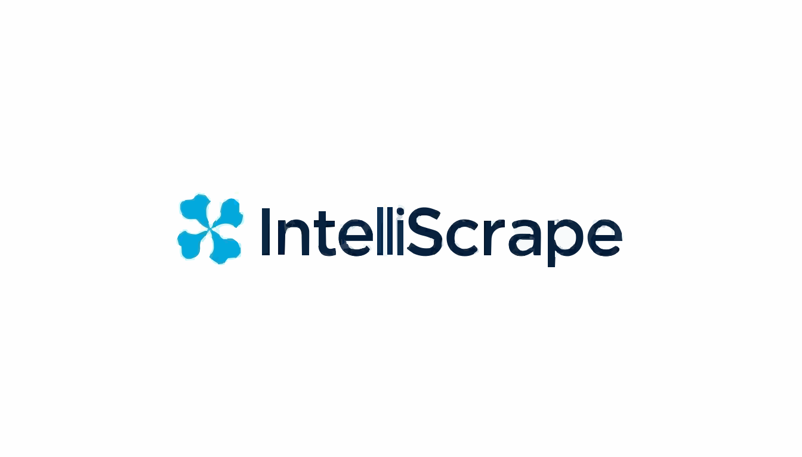
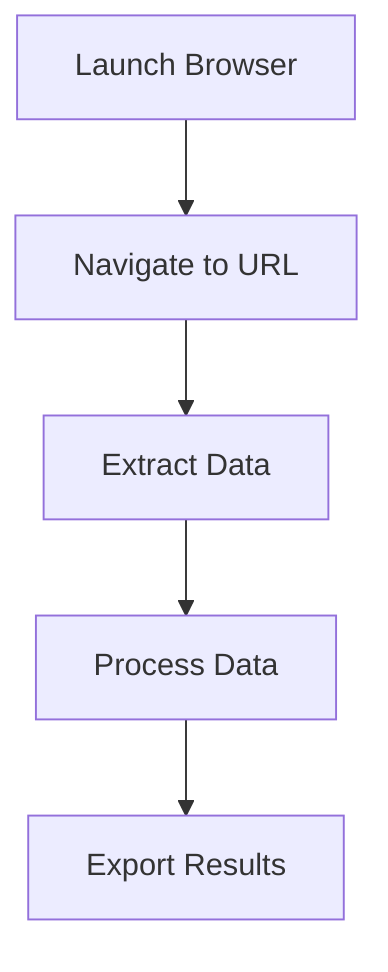

# IntelliScrape



IntelliScrape is a powerful web automation and scraping platform that enables users to create, manage, and execute complex workflows without writing code. Built with modern web technologies, it provides a user-friendly interface for automating web interactions and data extraction.

## Table of Contents
- [Features](#features)
- [Getting Started](#getting-started)
- [Installation](#installation)
- [Usage](#usage)
- [Workflow Management](#workflow-management)
- [Task Types](#task-types)
- [Execution System](#execution-system)
- [Credits System](#credits-system)
- [Security](#security)

## Features

- **Visual Workflow Builder**: Create complex automation workflows using a drag-and-drop interface
- **Multiple Task Types**: Support for various web automation and data extraction tasks
- **Scheduled Execution**: Run workflows on a schedule using cron expressions
- **Real-time Monitoring**: Track workflow executions with detailed logs
- **Credit-based System**: Fair resource allocation through a credit system
- **Secure Credential Management**: Safely store and use credentials in workflows
- **API Integration**: RESTful API for programmatic access
- **Detailed Analytics**: Track usage and performance metrics

## Getting Started

### Prerequisites
- Node.js (v18 or higher)
- npm or yarn
- SQLite database
- Modern web browser

### Installation

1. Clone the repository:
```bash
git clone https://github.com/yourusername/intelliscrape.git
cd intelliscrape
```

2. Install dependencies:
```bash
npm install
# or
yarn install
```

3. Set up environment variables:
```bash
cp .env.example .env
# Edit .env with your configuration
```

4. Initialize the database:
```bash
npx prisma migrate dev
```

5. Start the development server:
```bash
npm run dev
# or
yarn dev
```

## Usage

### Creating a Workflow

1. Navigate to the Workflows section
2. Click "Create New Workflow"
3. Add tasks using the visual editor
4. Configure task parameters
5. Connect tasks to create the workflow
6. Test and publish the workflow

### Example Workflow



### Task Configuration

Each task can be configured with:
- Input parameters
- Output mappings
- Error handling
- Retry settings

## Workflow Management

### States
- **DRAFT**: Development and testing phase
- **PUBLISHED**: Production-ready workflows

### Version Control
- Automatic version tracking
- Rollback capabilities
- Change history

## Task Types

### Browser Operations
- `LAUNCH_BROWSER`: Start browser instance
- `PAGE_TO_HTML`: Capture page content
- `EXTRACT_TEXT_FROM_ELEMENT`: Extract specific content

### Data Processing
- Text extraction
- Data transformation
- Export operations

### Each Task Includes:
- Label
- Icon
- Type
- Required inputs
- Expected outputs
- Credit cost

## Execution System

### States
- **Queued**: Waiting to start
- **Running**: Active execution
- **Completed**: Successful finish
- **Failed**: Error occurred

### Monitoring
- Real-time status updates
- Phase-by-phase tracking
- Detailed execution logs
- Performance metrics

## Credits System

### Credit Allocation
- Task-based consumption
- Variable credit costs
- Usage tracking
- Billing integration

### Management
- Credit balance monitoring
- Purchase additional credits
- Usage history
- Invoice generation

## Security

### Credential Management
- Encrypted storage
- Secure usage in workflows
- Access control
- Audit logging

### Data Protection
- End-to-end encryption
- Secure data handling
- Compliance with data protection regulations

## Contributing

We welcome contributions! Please follow these steps:

1. Fork the repository
2. Create your feature branch (`git checkout -b feature/AmazingFeature`)
3. Commit your changes (`git commit -m 'Add some AmazingFeature'`)
4. Push to the branch (`git push origin feature/AmazingFeature`)
5. Open a Pull Request

### Development Guidelines
- Follow the code style guide
- Write tests for new features
- Update documentation
- Use conventional commits

## License

This project is licensed under the MIT License - see the [LICENSE](LICENSE) file for details.

## Support

For support, please:
- Check the [documentation](docs/)
- Open an issue
- Contact support@intelliscrape.com

## Acknowledgments

- Thanks to all contributors
- Built with Next.js and Prisma
- Inspired by modern web automation needs

---

<div align="center">
  <sub>Built with ❤️ by the IntelliScrape team</sub>
</div>
