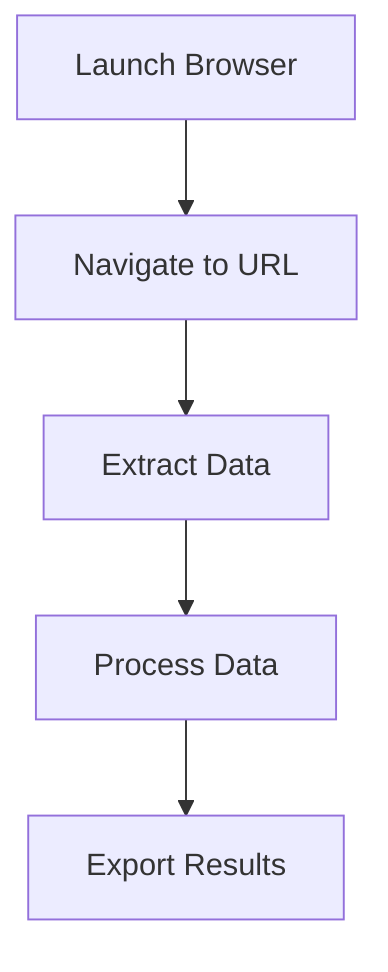

# IntelliScrape


IntelliScrape is a powerful web automation and scraping platform that enables users to create, manage, and execute complex workflows without writing code. Built with modern web technologies, it provides a user-friendly interface for automating web interactions and data extraction.

## Table of Contents
- [Features](#features)
- [Getting Started](#getting-started)
- [Installation](#installation)
- [Usage](#usage)
- [Workflow Management](#workflow-management)
- [Task Types](#task-types)
- [Execution System](#execution-system)
- [Credits System](#credits-system)
- [Security](#security)
- [Deployment](#deployment)

## Features

- **Visual Workflow Builder**: Create complex automation workflows using a drag-and-drop interface
- **Multiple Task Types**: Support for various web automation and data extraction tasks
- **Scheduled Execution**: Run workflows on a schedule using cron expressions
- **Real-time Monitoring**: Track workflow executions with detailed logs
- **Credit-based System**: Fair resource allocation through a credit system
- **Secure Credential Management**: Safely store and use credentials in workflows
- **API Integration**: RESTful API for programmatic access
- **Detailed Analytics**: Track usage and performance metrics

## Getting Started

### Prerequisites
- Node.js (v18 or higher)
- npm or yarn
- SQLite database
- Modern web browser

### Installation

1. Clone the repository:
```bash
git clone https://github.com/yourusername/intelliscrape.git
cd intelliscrape
```

2. Install dependencies:
```bash
npm install
# or
yarn install
```

3. Set up environment variables:
```bash
cp .env.example .env
# Edit .env with your configuration
```

4. Initialize the database:
```bash
npx prisma migrate dev
```

5. Start the development server:
```bash
npm run dev
# or
yarn dev
```

## Usage

### Creating a Workflow

1. Navigate to the Workflows section
2. Click "Create New Workflow"
3. Add tasks using the visual editor
4. Configure task parameters
5. Connect tasks to create the workflow
6. Test and publish the workflow

### Example Workflow



### Task Configuration

Each task can be configured with:
- Input parameters
- Output mappings
- Error handling
- Retry settings

## Workflow Management

### States
- **DRAFT**: Development and testing phase
- **PUBLISHED**: Production-ready workflows

### Version Control
- Automatic version tracking
- Rollback capabilities
- Change history

## Task Types

### Browser Operations
- `LAUNCH_BROWSER`: Start browser instance
- `PAGE_TO_HTML`: Capture page content
- `EXTRACT_TEXT_FROM_ELEMENT`: Extract specific content

### Data Processing
- Text extraction
- Data transformation
- Export operations

### Each Task Includes:
- Label
- Icon
- Type
- Required inputs
- Expected outputs
- Credit cost

## Execution System

### States
- **Queued**: Waiting to start
- **Running**: Active execution
- **Completed**: Successful finish
- **Failed**: Error occurred

### Monitoring
- Real-time status updates
- Phase-by-phase tracking
- Detailed execution logs
- Performance metrics

## Credits System

### Credit Allocation
- Task-based consumption
- Variable credit costs
- Usage tracking
- Billing integration

### Management
- Credit balance monitoring
- Purchase additional credits
- Usage history
- Invoice generation

## Security

### Credential Management
- Encrypted storage
- Secure usage in workflows
- Access control
- Audit logging

### Data Protection
- End-to-end encryption
- Secure data handling
- Compliance with data protection regulations

## Deployment

### AWS Deployment Guide for SQLite with Prisma

This guide provides step-by-step instructions for deploying IntelliScrape with SQLite and Prisma on AWS.

#### Prerequisites
- AWS Account
- AWS CLI installed and configured
- Docker installed (for containerization)
- AWS ECR access
- AWS ECS or EKS cluster
- AWS S3 bucket (for SQLite database backups)

#### 1. Database Considerations with SQLite

SQLite is a file-based database, which means:
- The database file needs to be stored in a persistent volume
- Only one instance can write to the database at a time
- Backups are essential for data safety

#### 2. Containerization

1. Create a Dockerfile:
```dockerfile
FROM node:18-alpine

WORKDIR /app

# Install SQLite
RUN apk add --no-cache sqlite

COPY package*.json ./
RUN npm install

COPY . .

# Create a directory for the SQLite database
RUN mkdir -p /data/db

# Set environment variable for the database path
ENV DATABASE_URL="file:/data/db/intelliscrape.db"

RUN npm run build

EXPOSE 3000

CMD ["npm", "start"]
```

2. Build and push to ECR:
```bash
# Login to ECR
aws ecr get-login-password --region your-region | docker login --username AWS --password-stdin your-account-id.dkr.ecr.your-region.amazonaws.com

# Create repository
aws ecr create-repository --repository-name intelliscrape

# Build and tag
docker build -t intelliscrape .
docker tag intelliscrape:latest your-account-id.dkr.ecr.your-region.amazonaws.com/intelliscrape:latest

# Push to ECR
docker push your-account-id.dkr.ecr.your-region.amazonaws.com/intelliscrape:latest
```

#### 3. Persistent Storage Setup

Since SQLite requires persistent storage, we'll use AWS EFS (Elastic File System):

1. Create an EFS file system:
```bash
aws efs create-file-system \
    --creation-token intelliscrape-db \
    --performance-mode generalPurpose \
    --throughput-mode bursting \
    --encrypted
```

2. Create mount targets in your VPC:
```bash
aws efs create-mount-target \
    --file-system-id fs-12345678 \
    --subnet-id subnet-12345678 \
    --security-groups sg-12345678
```

3. Create an EFS access point:
```bash
aws efs create-access-point \
    --file-system-id fs-12345678 \
    --posix-user Uid=1000,Gid=1000 \
    --root-directory Path="/data/db",OwnerUid=1000,OwnerGid=1000,Permissions=0755
```

#### 4. ECS Task Definition with EFS

Create a task definition that mounts the EFS volume:

```json
{
  "family": "intelliscrape",
  "networkMode": "awsvpc",
  "containerDefinitions": [
    {
      "name": "intelliscrape",
      "image": "your-account-id.dkr.ecr.your-region.amazonaws.com/intelliscrape:latest",
      "portMappings": [
        {
          "containerPort": 3000,
          "hostPort": 3000
        }
      ],
      "environment": [
        {
          "name": "DATABASE_URL",
          "value": "file:/data/db/intelliscrape.db"
        },
        {
          "name": "NODE_ENV",
          "value": "production"
        }
      ],
      "mountPoints": [
        {
          "sourceVolume": "efs-data",
          "containerPath": "/data/db",
          "readOnly": false
        }
      ]
    }
  ],
  "volumes": [
    {
      "name": "efs-data",
      "efsVolumeConfiguration": {
        "fileSystemId": "fs-12345678",
        "transitEncryption": "ENABLED",
        "authorizationConfig": {
          "accessPointId": "fsap-12345678",
          "iam": "ENABLED"
        }
      }
    }
  ],
  "requiresCompatibilities": ["FARGATE"],
  "cpu": "256",
  "memory": "512",
  "executionRoleArn": "arn:aws:iam::your-account-id:role/ecsTaskExecutionRole"
}
```

#### 5. ECS Service Creation

Create an ECS service with a single task (since SQLite doesn't support multiple writers):

```bash
aws ecs create-service \
    --cluster your-cluster \
    --service-name intelliscrape \
    --task-definition intelliscrape:1 \
    --desired-count 1 \
    --launch-type FARGATE \
    --network-configuration "awsvpcConfiguration={subnets=[subnet-12345678,subnet-87654321],securityGroups=[sg-12345678],assignPublicIp=ENABLED}"
```

#### 6. Load Balancer Setup

1. Create an Application Load Balancer:
```bash
aws elbv2 create-load-balancer \
    --name intelliscrape-alb \
    --subnets subnet-12345678 subnet-87654321 \
    --security-groups sg-12345678
```

2. Create a target group:
```bash
aws elbv2 create-target-group \
    --name intelliscrape-tg \
    --protocol HTTP \
    --port 3000 \
    --vpc-id vpc-12345678 \
    --target-type ip \
    --health-check-path /api/health
```

#### 7. Database Migration

Before deploying, run the Prisma migration:

```bash
# Locally
npx prisma migrate deploy

# Or in the container
docker run --rm -v $(pwd):/app -w /app your-account-id.dkr.ecr.your-region.amazonaws.com/intelliscrape:latest npx prisma migrate deploy
```

#### 8. Backup Strategy for SQLite

Since SQLite is file-based, implement a backup strategy:

1. Create an S3 bucket for backups:
```bash
aws s3 mb s3://intelliscrape-db-backups
```

2. Set up a backup script in your application:
```javascript
// backup.js
const { exec } = require('child_process');
const { S3Client, PutObjectCommand } = require('@aws-sdk/client-s3');
const fs = require('fs');
const path = require('path');

const s3Client = new S3Client({ region: 'your-region' });

async function backupDatabase() {
  const timestamp = new Date().toISOString().replace(/[:.]/g, '-');
  const backupPath = `/tmp/intelliscrape-${timestamp}.db`;
  
  // Copy the database file
  exec(`cp /data/db/intelliscrape.db ${backupPath}`, async (error) => {
    if (error) {
      console.error('Backup failed:', error);
      return;
    }
    
    // Upload to S3
    const fileStream = fs.createReadStream(backupPath);
    const uploadParams = {
      Bucket: 'intelliscrape-db-backups',
      Key: `backups/intelliscrape-${timestamp}.db`,
      Body: fileStream
    };
    
    try {
      await s3Client.send(new PutObjectCommand(uploadParams));
      console.log('Backup uploaded successfully');
      
      // Clean up local backup
      fs.unlinkSync(backupPath);
    } catch (err) {
      console.error('S3 upload failed:', err);
    }
  });
}

// Run backup daily
setInterval(backupDatabase, 24 * 60 * 60 * 1000);
backupDatabase(); // Run immediately on startup
```

3. Add the backup script to your Dockerfile:
```dockerfile
# Add to your Dockerfile
COPY backup.js /app/
RUN npm install @aws-sdk/client-s3
```

#### 9. Scaling Considerations

With SQLite, you can only run one instance that writes to the database. For scaling:

1. Use a read-only replica for read operations:
   - Deploy a second container with read-only access to the database
   - Configure your application to route read operations to this replica

2. Implement a queue system for write operations:
   - Use AWS SQS for queuing write operations
   - Process the queue with a single worker

#### 10. Monitoring Setup

1. Enable CloudWatch logging:
```bash
aws logs create-log-group --log-group-name /ecs/intelliscrape
```

2. Set up CloudWatch alarms for:
- CPU utilization
- Memory usage
- Error rates
- Response times
- Database file size

#### 11. SSL/TLS Setup

1. Request an SSL certificate:
```bash
aws acm request-certificate \
    --domain-name your-domain.com \
    --validation-method DNS
```

2. Configure the load balancer to use the certificate

#### 12. Production Readiness Checklist

1. Verify database connection and migrations
2. Test workflow execution
3. Check monitoring setup
4. Validate backup systems
5. Test error handling
6. Verify logging
7. Check SSL/TLS configuration
8. Perform load testing
9. Set up alerts for database size
10. Configure automatic backups

#### 13. Long-term Considerations

For a production environment with SQLite, consider:

1. **Database Size**: SQLite works well for small to medium-sized databases. Monitor growth.
2. **Concurrency**: SQLite has limitations with concurrent writes. Plan accordingly.
3. **Backup Frequency**: Adjust backup frequency based on data importance.
4. **Migration Path**: Consider migrating to PostgreSQL or another database when scaling becomes necessary.

#### 14. Troubleshooting

1. **Database Lock Issues**:
   - Check for multiple write attempts
   - Verify file permissions
   - Check disk space

2. **Performance Issues**:
   - Monitor database size
   - Check for long-running queries
   - Verify index usage

3. **Backup Failures**:
   - Check S3 permissions
   - Verify disk space
   - Check network connectivity

## Contributing

We welcome contributions! Please follow these steps:

1. Fork the repository
2. Create your feature branch (`git checkout -b feature/AmazingFeature`)
3. Commit your changes (`git commit -m 'Add some AmazingFeature'`)
4. Push to the branch (`git push origin feature/AmazingFeature`)
5. Open a Pull Request

### Development Guidelines
- Follow the code style guide
- Write tests for new features
- Update documentation
- Use conventional commits

## License

This project is licensed under the MIT License - see the [LICENSE](LICENSE) file for details.

## Support

For support, please:
- Check the [documentation](docs/)
- Open an issue
- Contact support@intelliscrape.com

## Acknowledgments

- Thanks to all contributors
- Built with Next.js and Prisma
- Inspired by modern web automation needs

---

<div align="center">
  <sub>Built with ❤️ by the IntelliScrape team</sub>
</div>
